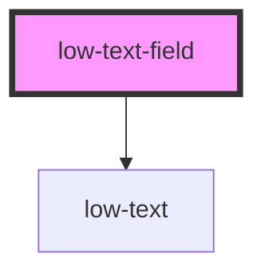

# low-text-field

<!-- Auto Generated Below -->

## Properties

| Property      | Attribute      | Description          | Type                                       | Default   |
| ------------- | -------------- | -------------------- | ------------------------------------------ | --------- |
| `fieldName`   | `field-name`   | { item_description } | `string`                                   | `'field'` |
| `fieldType`   | `field-type`   | { item_description } | `"email" \| "password" \| "tel" \| "text"` | `'text'`  |
| `fieldValue`  | `field-value`  | { item_description } | `string`                                   | `''`      |
| `isClearable` | `is-clearable` | { item_description } | `boolean`                                  | `false`   |
| `isDisabled`  | `is-disabled`  | { item_description } | `boolean`                                  | `false`   |
| `isReadOnly`  | `is-read-only` | { item_description } | `boolean`                                  | `false`   |
| `isRequired`  | `is-required`  | { item_description } | `boolean`                                  | `false`   |

## Events

| Event              | Description              | Type               |
| ------------------ | ------------------------ | ------------------ |
| `changeFieldValue` | Emits the changed value. | `CustomEvent<any>` |

## Dependencies

### Depends on

- [low-text](../low-text)

### Graph

---
