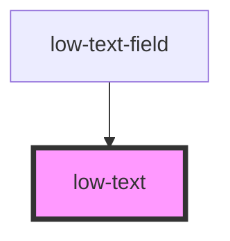

# low-text

<!-- Auto Generated Below -->

## Properties

| Property        | Attribute        | Description          | Type                                                                  | Default     |
| --------------- | ---------------- | -------------------- | --------------------------------------------------------------------- | ----------- |
| `contentAfter`  | `content-after`  | { item_description } | `string`                                                              | `undefined` |
| `contentBefore` | `content-before` | { item_description } | `string`                                                              | `undefined` |
| `size`          | `size`           | { item_description } | `"+1" \| "+2" \| "+3" \| "+4" \| "+5" \| "+6" \| "-1" \| "-2" \| "0"` | `'0'`       |
| `weight`        | `weight`         | { item_description } | `"heavy" \| "soft" \| "strong"`                                       | `'soft'`    |

## Dependencies

### Used by

- [low-text-field](../low-text-field)

### Graph

---
